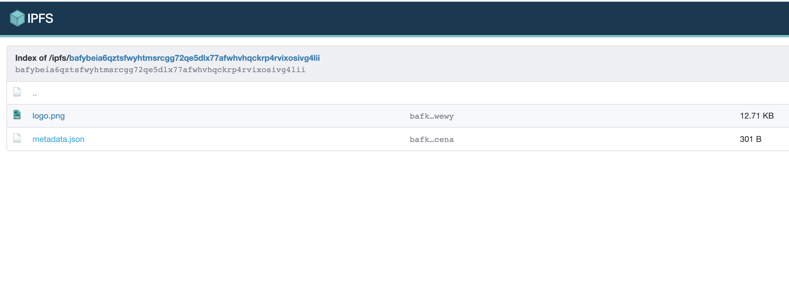
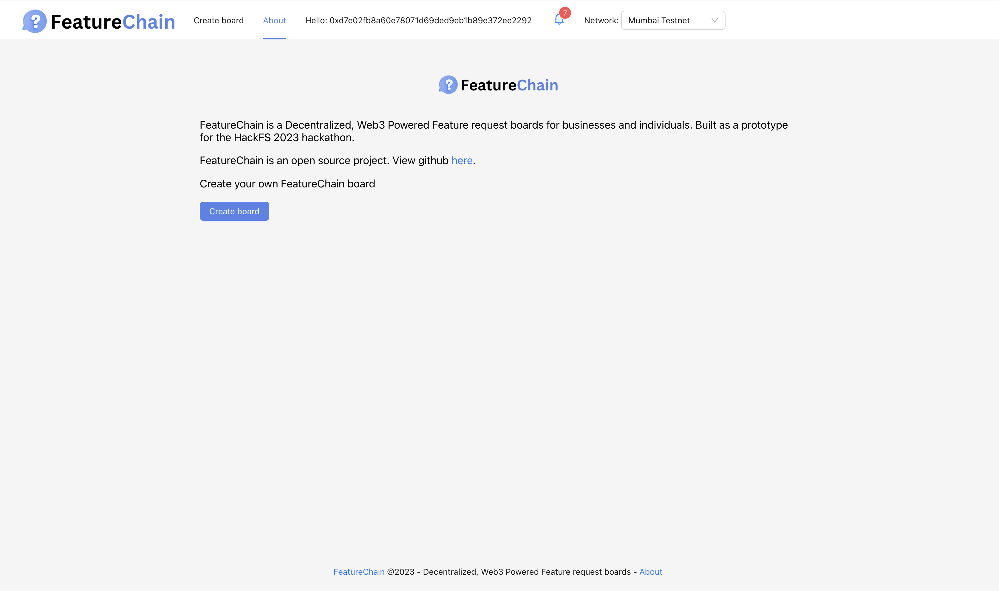

 

    

 

FeatureChain
---

FeatureChain is an open source decentralized app that empowers users to create and manage public feature request boards without using centralized platform authorities such as Jira or Trello.

Live demo url (spheron deployment): https://bafybeiectanzynjk4nkiaixyi4cjewbenaqeyeo45lz6elriinpjepkrua.ipfs.sphn.link/

Demo Video: https://youtu.be/0PEgw0koge8

### Motivation

Existing apps like Trello and Jira have made significant contributions to project management and collaboration, but they have limitations when it comes to managing public feature requests. A decentralized app can provide a revolutionary solution that addresses these shortcomings and offers unique benefits for effective feature request management.

Trello is widely recognized for its user-friendly interface and visual approach to task management. However, it lacks specialized features specifically designed for managing feature requests. Its primary focus is on task and project management, making it less suitable for collecting, organizing, and prioritizing feature ideas from a large user base. In contrast, a decentralized app can be purpose-built to cater to the needs of users primarily interested in suggesting and voting on new features. It can provide dedicated features such as voting mechanisms, status tracking, and customizable categorization to effectively manage and prioritize feature requests.

On the other hand, Jira is a comprehensive project management tool favored by development teams. While it offers advanced features for issue tracking and workflow management, its complexity can be overwhelming, especially for non-technical stakeholders who want to contribute feature ideas. A decentralized app can bridge this gap by providing a simplified and user-friendly interface that encourages participation from a wider audience. By removing unnecessary complexities, it enables non-technical users to easily submit feature requests, contribute feedback, and engage in the decision-making process.

Additionally, both Trello and Jira suffer from a centralized approach to feature request management. They rely on a central authority or project administrators to review and prioritize requests, which can lead to delays and lack of transparency. A decentralized app, built on blockchain technology, can introduce decentralized governance and transparency. Users can directly participate in the decision-making process, with voting mechanisms ensuring that popular feature requests are given higher priority. 

FeatureChain currently supports creating product request boards with custom images, saving public requests, notifying board owners on new submissions, and having the boards managed for free using decentralized tooling.

## Technologies used

* Filecoin and Web3.storage: Used for file storage, image, and artifact storage for board metadata and requests. Stores initial board metadata and logos for dynamic serving without additional user cost. IPFS is also used with Spheron to host the web frontend.
* Polybase: Acts as a decentralized web3 Firebase. Used for ticket and board storage queries and persistance. With Polybase, FeatureChain doesn't need a hosted backed for owner accounts and instead add and pulls lists of active boards for a given account from a 'FeatureChain' collection based on the active account wallet address.
* Push protocol: The owner of a board (based on their logged in address) receives a notification through push protocol when a new request is published to a board owned by their account. Board owners don't need to monitor the boards directly and instead can reference these notifications.
* Spheron: Live demo was enabled by Spheron/IPFS. Hosting and CICD on every new update of the FeatureChain platform main branch. Saved using Filecoin.

### How to run

1. Define the following env variables (either locally or in a created `.env` file). These are configured with test values on the demo site.

<pre>
    REACT_APP_POLYBASE_NAMESPACE= # your custom namespace for polybase deployment/backend.
    REACT_APP_STORAGE_KEY = # your web3.storage storage key.
    REACT_APP_PUSH_PK= # (Optional) push protocol wallet private key for connected FeatureChain staging channel.
</pre>

2. `yarn; yarn start`

### Example FeatureChain pages (try these out!)

https://bafybeiectanzynjk4nkiaixyi4cjewbenaqeyeo45lz6elriinpjepkrua.ipfs.sphn.link/board/6c4bfc5d-6545-4bcb-8eb7-e259cec6d61d

### Screenshots

#### Home

#### Creating a new board

#### Filled information

#### Success

#### IPFS manages board metadata after creation and hosts board images.

#### Board page

#### About page

#### Spheron hosting / successful build

#### Polybase schema

#### Stored boards and tickets on polybase

### Useful links

Event page:  https://ethglobal.com/events/hackfs2023/home
Sponsors: https://ethglobal.com/events/hackfs2023/prizes

### Potential Future Work:

Premium Feature Tiers: Introduce premium feature tiers with advanced functionality, custom integrations, and dedicated support for power users and businesses.

Data-driven Insights and Analytics: Offer comprehensive analytics reports, trend analysis, and user sentiment analysis as a subscription-based service.

Sponsored Feature Requests: Implement a sponsorship model where businesses pay to prioritize their feature requests for increased visibility and additional revenue.

<!-- 

Demo flow:
Introduction and Overview (30 seconds)

Introduce the presenter and briefly explain the purpose of the demo.
Provide a high-level overview of FeatureChain and its main benefits.
Time Allocation: 30 seconds
Comparison to Existing Solutions (1 minute)

Present a brief comparison of existing solutions like Trello and Jira.
Highlight the limitations of these solutions in managing public feature requests.
Emphasize how FeatureChain fills the gaps and offers a decentralized approach for effective feature request management.
Time Allocation: 1 minute
Submitting a Feature Request (1 minute)

Demonstrate how users can easily submit a feature request through the app.
Walk through the process of filling in request details and attaching supporting files.
Emphasize the simplicity and user-friendliness of the submission process.
Time Allocation: 1 minute
Collaborative Voting and Decentralized Governance (1 minute)

Showcase the collaborative voting system and decentralized governance of FeatureChain.
Show how users can browse and vote on feature requests based on their priorities.
Explain how decentralized decision-making ensures transparency and inclusivity.
Time Allocation: 1 minute
Revenue Opportunities (30 seconds)

Discuss the potential revenue opportunities available for FeatureChain.
Mention premium feature tiers, data-driven insights as a service, and the sponsored feature requests model.
Provide a brief overview of how these revenue streams can support the growth and sustainability of FeatureChain.
Time Allocation: 30 seconds
Conclusion and Call to Action (30 seconds)

Recap the key features and benefits of FeatureChain.
Encourage participants to explore the app further, engage with its features, and provide feedback.
Share contact information or any next steps for further engagement with the project.
Time Allocation: 30 seconds

Sponsors:

-->